## What I Do

I help Planner Agent design effective Mermaid diagrams for course content by:

1. **Recommending diagram types** based on concept nature and target audience
2. **Providing template examples** for various diagram types (flowchart, sequence, class, state, gantt, etc.)
3. **Adjusting complexity** based on learner level (beginner, advanced, decision-maker)
4. **Ensuring validation** with mermaid-validator skill before output

## When to Use Me

Use this skill when:
- Planner Agent is designing visualizations for course content
- You need to choose the right Mermaid diagram type for a concept
- You need template examples for specific diagram types
- You want to adjust diagram complexity based on audience
- You're creating the "Visualizations" section in section research files

## How I Work

### Step 1: Analyze Concept Nature

Determine what kind of relationship you're representing:

| Concept Type | Recommended Mermaid Type |
|-------------|----------------------|
| Flow/Steps | flowchart |
| Time Sequence | sequenceDiagram |
| Hierarchy | classDiagram |
| State Transition | stateDiagram |
| Timeline/Schedule | gantt |
| Relationship | erDiagram |
| Knowledge Structure | mindmap |
| History/Milestones | timeline |

### Step 2: Match Target Audience

Adjust complexity based on who will see the diagram:

| Audience | Complexity | Design Principles |
|----------|-------------|------------------|
| **Beginners** | Low | Few nodes, clean labels, clear flow |
| **Advanced** | High | Full details, edge cases, trade-offs |
| **Decision Makers** | Medium | High-level, key paths, simplified |

### Step 3: Use Appropriate Template

Select from templates below based on your chosen type and audience.

### Step 4: Validate

Always use `mermaid-validator` skill after creating Mermaid code:

```bash
mmdc -i ./weekXX/plan/section_XX_research.md -o /tmp/mermaid-validation.svg 2>&1
```

Mark validation status:
- ✅ Validated - Syntax is correct
- ❌ Needs Fix - Fix syntax errors
- ⚠️ Warnings - Valid but has warnings

## Prerequisites

- **Mermaid CLI (mmdc)**: Version 11.12.0 or higher
- **mermaid-validator skill**: Must be available in `.opencode/skill/`
- **Understanding of diagram types**: Know which type fits which concept

## Templates

### Math-Oriented Templates

#### Flowchart - Algorithm Steps (Beginner)

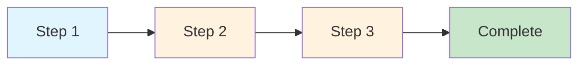

#### Flowchart - Algorithm Steps (Advanced)

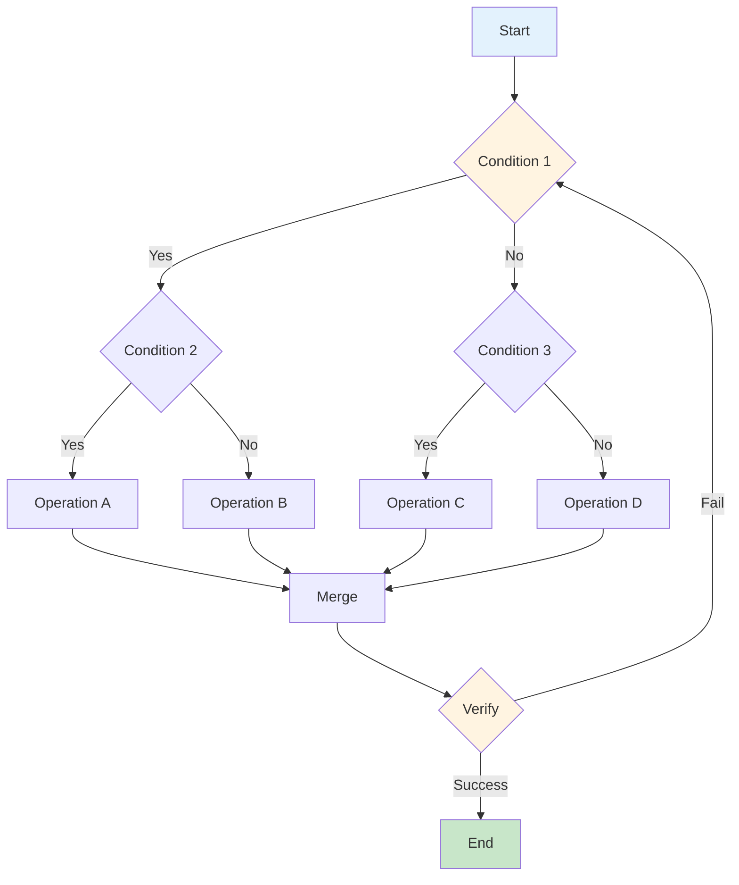

#### Mindmap - Formula Relationships

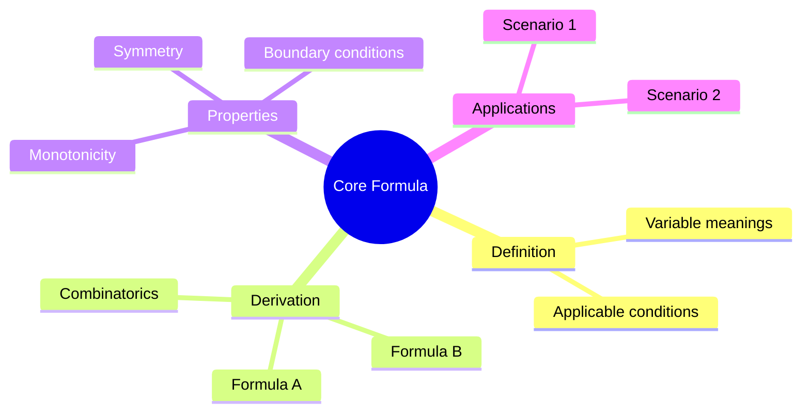

#### Pie - Distribution Analysis

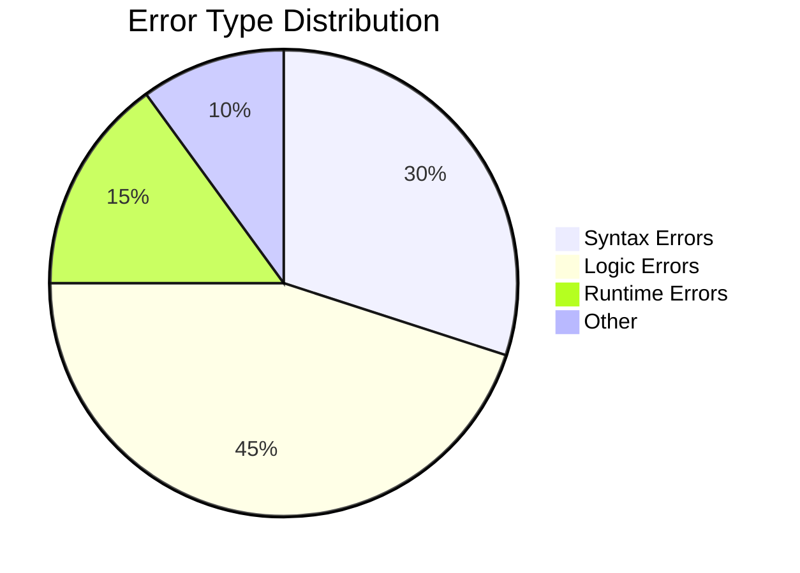

---

### Implementation-Oriented Templates

#### Sequence Diagram - API Calls

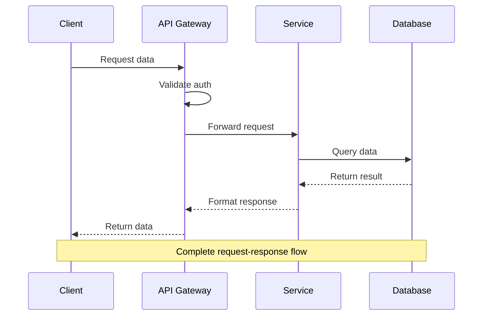

#### Class Diagram - Module Architecture

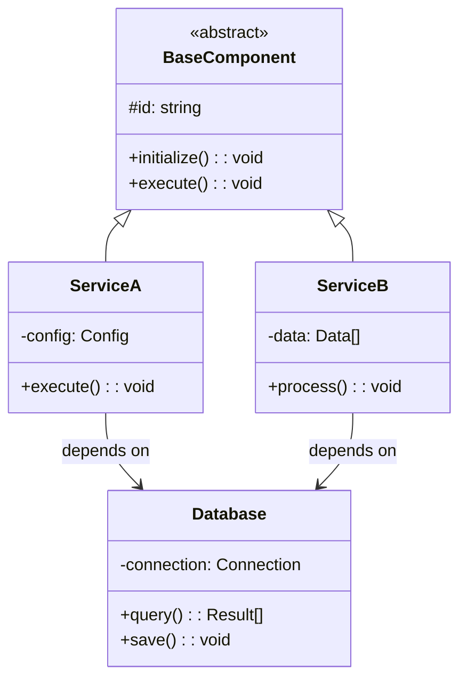

#### State Diagram - Lifecycle

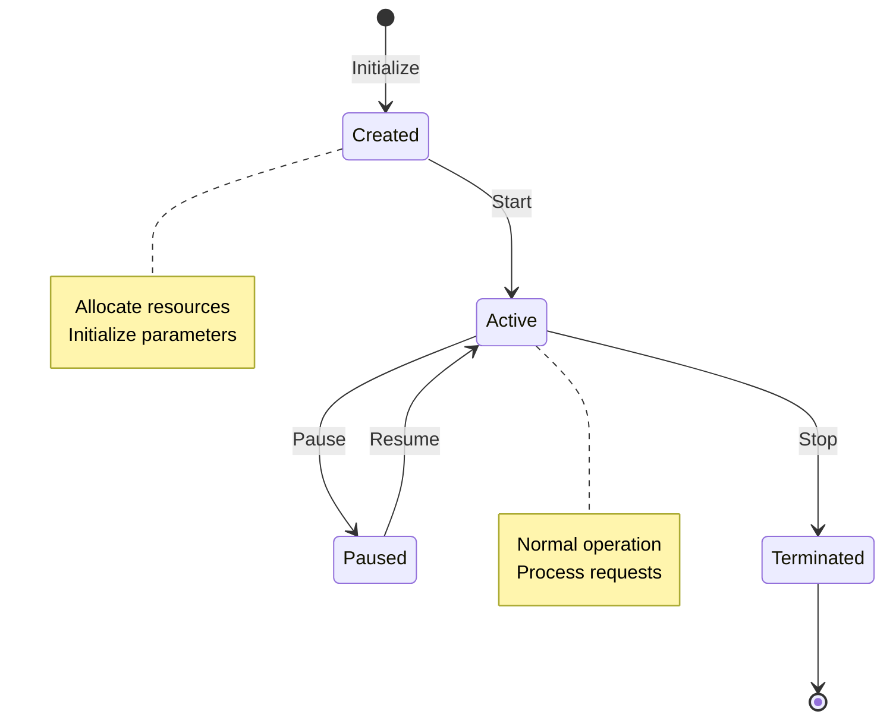

#### Gantt - Deployment Pipeline

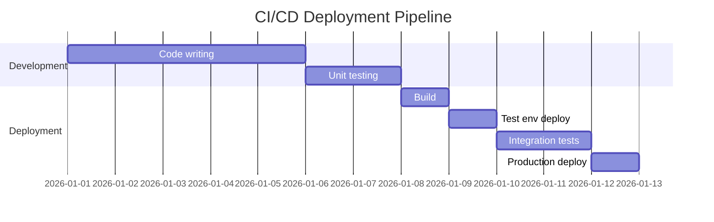

---

### Concept-Oriented Templates

#### Mindmap - Knowledge Structure

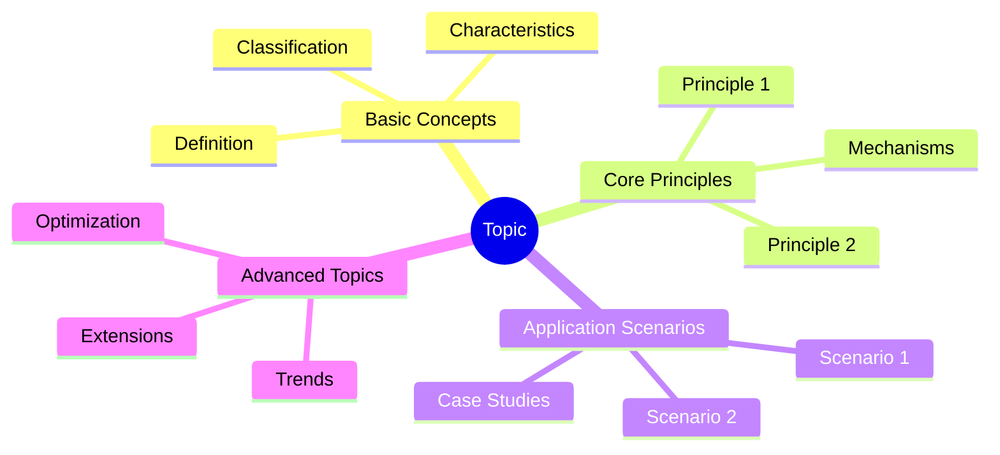

#### Flowchart - Decision Tree (Decision Makers)

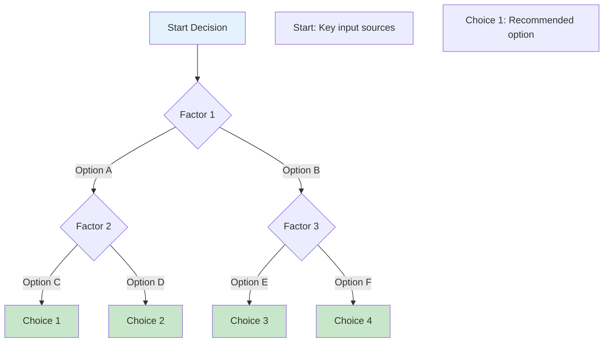

#### Timeline - Historical Evolution

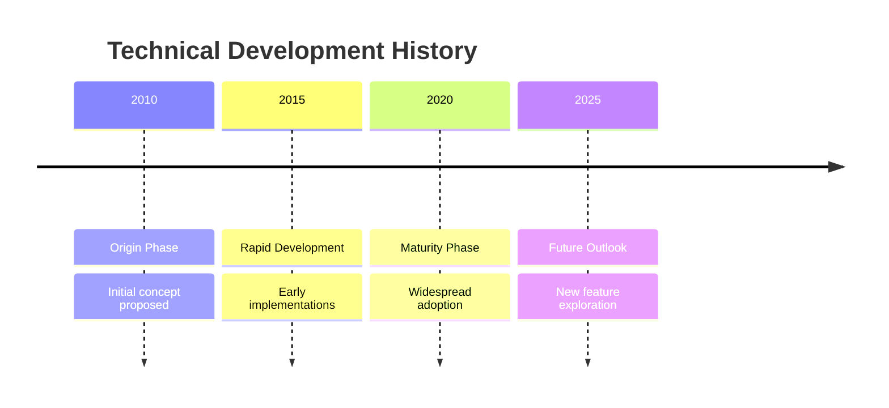

#### ER Diagram - Concept Relationships

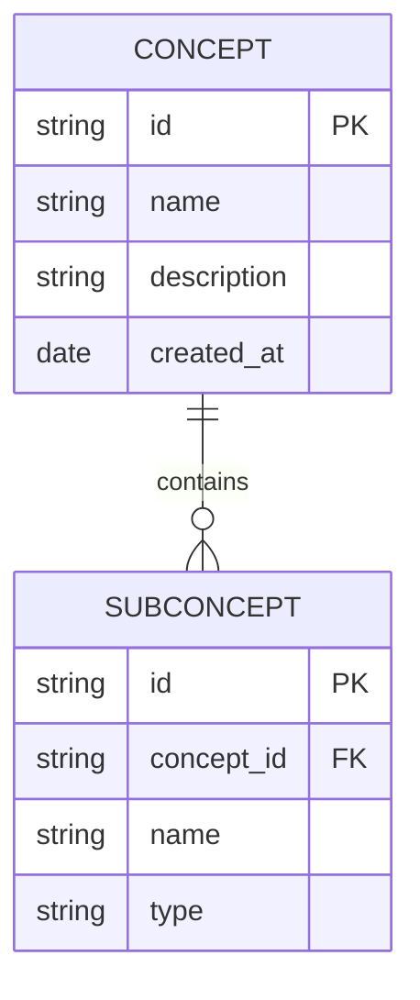

---

## Course-Specific Mapping

### Math-Oriented Courses

| Topic | Recommended Type | Purpose |
|-------|----------------|---------|
| **Algorithm Flow** | flowchart | Show steps, decisions, loops |
| **Proof Logic** | flowchart + timeline | Logical derivation + history |
| **Formula Relations** | mindmap | Derivation relationships |
| **Recursion** | flowchart | Recursive call expansion |
| **Scope Analysis** | pie | Solution space, coverage |

### Implementation-Oriented Courses

| Topic | Recommended Type | Purpose |
|-------|----------------|---------|
| **System Architecture** | classDiagram | Modules, classes, dependencies |
| **API Design** | sequenceDiagram | Request-response flow |
| **Data Flow** | flowchart | Data movement, processing pipeline |
| **State Management** | stateDiagram | State changes, transitions |
| **Deployment** | gantt | CI/CD steps, environment deployment |

### Concept-Oriented Courses

| Topic | Recommended Type | Purpose |
|-------|----------------|---------|
| **Knowledge Body** | mindmap | Concept hierarchy, associations |
| **Design Principles** | classDiagram | Design patterns, architecture |
| **Trade-off Analysis** | flowchart | Decision tree, trade-off paths |
| **Historical Evolution** | timeline | Development phases, iterations |
| **Use Cases** | pie | Application distribution, cases |

---

## Common Mistakes to Avoid

| Mistake | Description | Prevention |
|----------|-------------|-------------|
| **Over-complexity** | Too many nodes, messy connections | Adjust complexity by audience, split large diagrams |
| **Wrong Type** | Using inappropriate type for concept | Use type mapping table to select correctly |
| **Unclear Labels** | Vague node/line labels | Use clear professional terminology |
| **Chaotic Hierarchy** | Unclear level structure | Use mindmap to clarify levels |
| **Missing Validation** | Not validating Mermaid syntax | Use mermaid-validator skill |
| **Invalid Syntax** | Using unsupported syntax in node labels | Follow syntax rules below |

---

## Syntax Rules (CRITICAL)

### Flowchart Node Labels

**❌ WRONG - Using `<br/>` in node labels:**
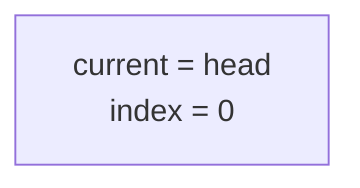

**✅ CORRECT - Using quotes and newline:**


**Key Rules:**
1. **NEVER use `<br/>` in flowchart node labels** - it causes parse errors
2. **Use double quotes** for multi-line text: `["line1\nline2"]`
3. **Always quote labels** with special characters (`:`, `(`, `)`, `-`, etc.)
4. **For notes/annotations**: Create a regular node with quoted text

**❌ WRONG - Invalid note syntax:**
```mermaid
noteA[Complexity: O(n)]
note for A[Complexity: O(n)]
```

**✅ CORRECT - Regular node for annotations:**
```mermaid
complexityA["Complexity O(n)
Must traverse to find position"]
```

### Sequence Diagram Notes

Sequence diagrams support `<br/>` in notes:

**✅ CORRECT:**
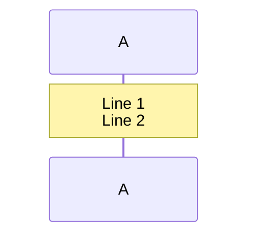

### Type-Specific Syntax Support

| Diagram Type | `<br/>` in labels | `style` directive | Notes |
|-------------|-------------------|------------------|-------|
| **flowchart** | ❌ No | ✅ Yes | Use quoted newlines |
| **sequenceDiagram** | ✅ Yes | ❌ No | Supports `<br/>` |
| **classDiagram** | ❌ No | ✅ Yes | Use quoted newlines |
| **stateDiagram** | ❌ No | ✅ Yes | Use quoted newlines |
| **gantt** | N/A | ✅ Yes | Uses task names |
| **mindmap** | ❌ No | ❌ No | Use indentation |
| **erDiagram** | N/A | ❌ No | Uses entities |

---

## ⚠️ 驗證失敗常見原因

### 常見錯誤 #1: Flowchart 中使用 `<br/>`

**錯誤訊息：**
```
Parse error on line X
...head<br/>(address: 1000)]...
Expecting 'SQE', 'DOUBLECIRCLEEND', 'PE', '-)', 'STADIUMEND', 'SUBROUTINEEND', 'PIPE', 'CYLINDEREND', 'DIAMOND_STOP', 'TAGEND', 'TRAPEND', 'INVTRAPEND', 'UNICODE_TEXT', 'TEXT', 'TAGSTART', got 'PS'
```

**原因：** Mermaid flowchart 不支援 `<br/>` 語法

**修復：**
```mermaid
# ❌ 錯誤
A[head pointer<br/>(address: 1000)]

# ✅ 正確
A["head pointer
(address: 1000)"]
```

### 常見錯誤 #2: 使用無效的 note 語法

**錯誤訊息：**
```
Parse error on line X
...noteA[Complexity: O(n)]...
Expecting 'SQE', 'DOUBLECIRCLEEND', 'PE', '-)', 'STADIUMEND', 'SUBROUTINEEND', 'PIPE', 'CYLINDEREND', 'DIAMOND_STOP', 'TAGEND', 'TRAPEND', 'INVTRAPEND', 'UNICODE_TEXT', 'TEXT', 'TAGSTART', got 'PS'
```

**原因：** `noteA[...]` 不是有效的 flowchart 語法

**修復：**
```mermaid
# ❌ 錯誤
noteA[Complexity: O(n)]
note for A[Complexity: O(n)]

# ✅ 正確
complexityA["Complexity O(n)
Worst case check all nodes"]
```

**記住：** 在 flowchart 中，註解是普通節點，不是特殊語法！

### 常見錯誤 #3: 節點標籤包含特殊字符

**錯誤訊息：**
```
Parse error on line X
...head = null/None)]...
Expecting 'SQE', ... got 'PS'
```

**原因：** 特殊字符（`:`, `(`, `)`, `-`）在方括號中會被解析器誤認

**修復：**
```mermaid
# ❌ 錯誤
A[head = null/None]
B{Is position = 0?}

# ✅ 正確
A["head = null/None"]
B["Is position = 0?"]
```

**規則：** 任何包含特殊字符的標籤都應該用雙引號包圍。

### 常見錯誤 #4: ER Diagram 關係語法錯誤

**錯誤訊息：**
```
Parse error on line X
...}|--|| AdjacencyNode "B" : edge    Vertex {...
Expecting 'EOF', 'SPACE', 'NEWLINE', ... got 'IDENTIFYING'
```

**原因：** ER diagram 的關係定義過於複雜或不正確

**修復：**
```mermaid
# ❌ 錯誤（過於複雜）
erDiagram
    Vertex ||--o{ AdjacencyNode : connects to
    Vertex { int id }
    AdjacencyNode { int vertex_id }
    Vertex "A" }|--|| AdjacencyNode "B" : edge

# ✅ 正確（簡化）
erDiagram
    Vertex {
        int id
        string name
        AdjacencyNode adj_list
    }

    AdjacencyNode {
        int vertex_id
        AdjacencyNode next
    }
```

**規則：** ER diagram 應該保持簡潔，複雜的實例關係容易導致解析錯誤。

---


---

## Output Format

When this skill is active, Planner Agent should output Mermaid diagrams in section research files:

```markdown
## Visualizations

### Diagram 1: {Diagram Name}
- **Type**: flowchart / sequence / class / state / gantt / er / mindmap / timeline
- **Purpose**: Explain [concept/flow/architecture]
- **Target Audience**: [beginner/advanced/decision-maker]
- **Key Elements**:
  - Element A: Description
  - Element B: Description
  - Relationship A→B: Description
- **Mermaid Code**:
  ```mermaid
  [mermaid code from templates]
  ```
- **Validation Status**: ✅ / ❌ / ⚠️
- **Notes**: [Description, teaching tips]
```

---

## Notes

1. **Always validate** Mermaid code before marking task complete
2. **Match diagram type** to concept nature (refer to type mapping)
3. **Adjust complexity** based on audience (beginner → simple, advanced → detailed)
4. **Use consistent naming** for nodes and connections
5. **Add teaching tips** in the "Notes" section to help Slide Generator
6. **Store validated diagrams** in Blackboard for Slide Generator access
7. **Use subgraphs** to group related elements when helpful
8. **Add style directives** to highlight important elements (flowchart, class, state diagrams only)
9. **CRITICAL**: Never use `<br/>` in flowchart node labels - use quoted newlines instead
10. **CRITICAL**: Always quote node labels containing special characters (`:`, `(`, `)`, `-`, etc.)
11. **CRITICAL**: Sequence diagrams don't support `style` directives - use labels instead
12. **CRITICAL**: Annotations in flowcharts must be regular nodes with quoted text

## Resources

- [Mermaid Official Documentation](https://mermaid.js.org/intro/)
- [Mermaid Live Editor](https://mermaid.live/)
- [mermaid-validator Skill](/.opencode/skill/mermaid-validator/SKILL.md)
- [Planner Agent](/.opencode/agent/planner.md)
